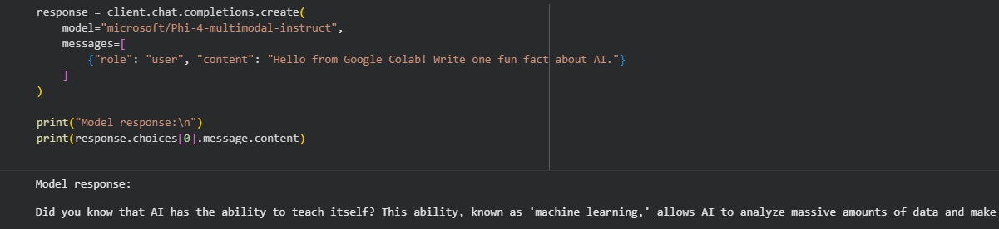
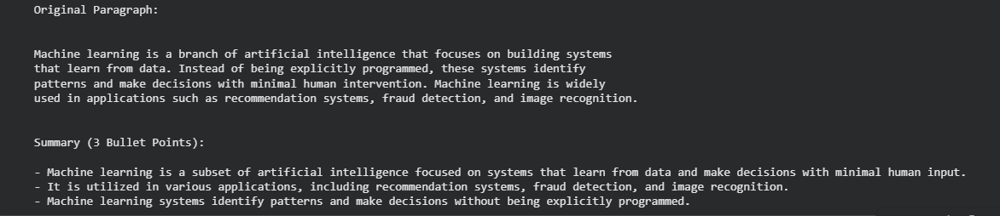

# Lab Title: Using GitHub Marketplace Models 
(Text Summarization)

## Objectives
- Learn how to use GitHub Marketplace Models via API in Google Colab
- Make a first successful model call
- Build a mini text summarization project
- Understand API updates and model integration in Google Colab

## Steps Completed
1. Installed the OpenAI Python client and set up the GitHub token
2. Created a client for GitHub Marketplace Models
3. Made the first model call to test the connection
4. Implemented a mini project: summarizing a paragraph into 3 bullet points
5. Fixed issues caused by API updates and learned the correct method usage

## Colab Notebook
[Open the Google Colab Notebook](https://colab.research.google.com/drive/105INRFh8Cl7dZSSlXNMAUdud-55j4HU6?usp=sharing)

## Screenshot of Playground

## Mini Project Summary
The mini project focuses on summarizing a given paragraph into exactly three bullet points
using a GitHub Marketplace language model. The project demonstrates how AI models can
process and condense text effectively using prompt-based instructions.
